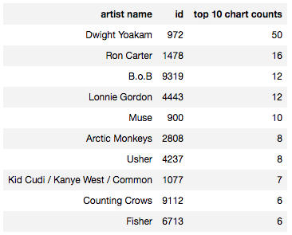
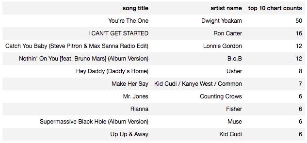
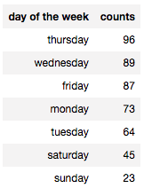

# Data Warehouse Project
# Redshift ETL

This project uses boto3 library to instantiate a Redshift cluster programmatically (IaC), and uses the Python Postgres library psycopg2 to execute queries on the Redshift cluter.

The data resides in S3 objects as JSON files, and so the SQL scripts use the COPY command in Redshift to import all data. Data is loaded from S3 into staging tables in Redshift, then dimensional tables and a fact table are created in Redshift out of the staging tables


## User Guide

Please use redshift_main.py as the main script to run. Also, please populate 'cred.cfg' with the right AWS credentials, as this will automatically create the Redshift cluster, and then wait until the cluster is ready, before starting the table creation, and the ETL process.

Note: The script however does not have a function to delete the cluster since this will happen after some arbitrary time.


## Purpose of the Database

In the context of this startup, the purpose of the newly created OLAP database after the ETL is to support Sparkify in deriving business insights from their user data. The database will help them for example find out basic analytics, such as the most popular artists, the most popular songs, and when peak listening hours are. 

The database will also support in more advanced analytics, such as knowing customer preferences, e.g. customer segmentation by genre, location, or behavior. 

The next step would be to use this in predictive services, such as suggesting to their clients songs they might like, that they didn't listen to before. 


## Database Schema Design Justification 

Getting the log data, clearning it, joining it, and storing in an separate data warehouse makes sense for analytical queries. And a star schema is very useful in achieving the above mentioned goals. 

A star schema with dimensions and a fact table makes joins relatively quick and easy, and pre-defined analytics (cube) can be generated to answer simple questions. It can also support efficiently ad-hoc queries.

For the ETL pipeline, the data is loaded from JSON log files first into staging tables in Redshift, so that all data from numerous files is placed into one table. Since Redshift doesn't support capital letters in column fields, a JSON path file had to be used to load the log files. 

The next step is be a SQL-to-SQL ETL that would first extract data to the dimension tables as User, Song, Artist and Time dimensions, and then populate the songplay fact table with the new proper keys from the dimension tables. 

For populating the fact table, I chose to load data that was joined on the song title and the artist name. That seems like the proper thing to do, since there are many songs with the same name, and there might be artists with slightly different names. This however will yield a small fact table (only around 400 rows i think), since there the log files doen't have song IDs or artist IDs, and there are lots of songs with similar titles, but that belong to different artists. 


## Example Queries

The following SQL query retrieves the top 10 artists that users listen to: 

```
select a.name as "Artist Name", sp.artist_id as "ID", count(*) as "Top 10 Chart Counts"
from songplay as sp
join dimArtist a on sp.artist_id = a.aid
group by sp.artist_id, a.name
order by "Top 10 Chart Counts" DESC, name ASC  
limit 10
```
The result of the query is below:




Another query is the list of the top 10 songs that people listen to:

```
select s.title as "Song Title", a.name as "Artist Name", count(*) as "Top 10 Chart Counts"
from songplay as sp
join dimArtist a on sp.artist_id = a.aid
join dimSong s on sp.song_id = s.sid
group by sp.song_id, s.title, a.name
order by "Top 10 Chart Counts" DESC, s.title ASC  
limit 10
```

The result of the query is below:




The following query gives an idead about the user behavior based on day of the week:

```
select t.dow as "Day of the Week", count(*) as "Counts"
from songplay as sp
join dimTime t on sp.start_time = t.start_time
group by t.dow
order by counts DESC  
limit 10
```

The result of the query is below:




